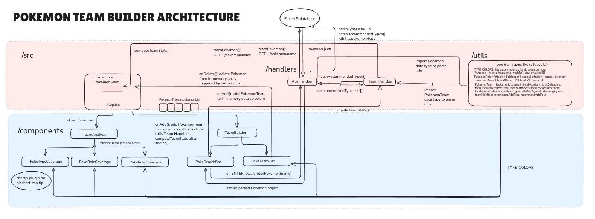

# Pokemon Team Builder

This simple web app helps you seamlessly add Pokemon to your team, view their performance at a glance and gives you actionable feedback on which pokemon types and roles can be added to improve your team


## Contents

1. [Overview](#overview)
    * [Features](#features)
    * [Architecture](#architecture)
2. [Setup Instructions](#getting-started)
3. [Design decisions + data assumptions](#design-decisions--data-assumptions)

## Overview

### Features

- **Find your Pokemon**: Search and enter the name of any ***existing*** Pokemon to add it to your team
- **Build your team**
  - View the type of each Pokemon with its corresponding color
    *e.g. Pikachu is an electric-type (yellow) pokemon*
  
  *e.g. Charizard is a  dual-type fire (orange) and flying (light purple) pokemon*
  
  - Delete a Pokemon from your team by hovering over its card and clicking the `X` that appears at the right/ simply clicking the card
- **Analyse your team**
Team analytics are shown in the yellow section in real-time as you add and delete Pokemon. These operations are performed on the team list using attributes accessed through the `Pokemon` data type(see [Pokemon data type](#pokemon-data-type) for more info)

    - **Type Coverage**
        - **Type distribution**: Hover over the pie chart sections to see how many Pokemon you have of that corresponding type
        - **Strengths/Weaknesses**: Displays the types which Pokemon in your team are strong against and weak towards, respectively
            - Calculated by aggregating all unique strengths and weaknesses of individual Pokémon (`Pokemon::strongAgainst`, `Pokemon::weakTo`) 
    - **Role Coverage**
        - **Majority role**
            - Your team may recieve either `Attacker-heavy`, `Defender-heavy` and `Balanced` qualifications for its role coverage
            
            - Calculated by comparing total numbers of attackers and defenders by summing counts of 
                - **attackers** (`PokemonRole.physical`, `PokemonRole.special`) vs
                - **defenders** (`PokemonRole.defender`)
             
        - **Role counts**
            - Simple dot chart visual of raw counts of `physical` and `special` attacker-role pokemon, as well as `defender` role Pokemon in your team
    - **Recommendations**
        - **Role recommendations**: Advice on what role of Pokemon to add 
            - *e.g. if team is **attacker-heavy**, it recommends adding more **defensive** pokemon*
            - *e.g. if a team is **balanced**, it will state so*
        - **Type recommendations**: Advice on what types of Pokemon to add
            - Recommended by taking team's `weak-against` types and 


  

#### What this app does
Provides a simple **team-level** overview of strengths and weaknesses, focusing on balancing out your team against different Pokemon types.

#### What this app does not do
* Visualise attack power (CP)
* Visualise stamina (HP)

### Architecture



## Setup instructions
**NOTE**: The following setup instructions are taken from https://github.com/jhordyess/react-tailwind-ts-starter/blob/main/README.md, as this project was used as a template to work off. Further justifications are [below](#template-credits-and-tech-stack-justification)
### Prerequisites

1. Install [Node.js](https://nodejs.org/en/download) (LTS version recommended).
2. Install [pnpm](https://pnpm.io/installation) globally:

```sh
npm install -g pnpm@latest-10
```

### Setup project for development

1. Clone the repository:

```sh
git clone 
```

2. Navigate to the project folder:

```sh
cd Pokemon-Team-Builder
```

3. Install dependencies:

```sh
pnpm i
```

4. Start the development server:

```sh
pnpm dev
```

5. Open your browser and visit [http://localhost:5173](http://localhost:5173) to see your project.


### Commands

#### Start the development server

```sh
pnpm dev
```

#### Build the project for production

```sh
pnpm build
```

#### Preview the project before production

```sh
pnpm start
```

#### Run TypeScript checks

```sh
pnpm ts-check
```

#### Lint the code

```sh
pnpm lint
```

#### Validate the project (lint + TypeScript checks)

```sh
pnpm validate
```

#### Format the code

```sh
pnpm format
```
---

## Design decisions + data assumptions


### Template credits and tech stack justification

This project has used https://github.com/jhordyess/react-tailwind-ts-starter.git as a starter, as it contained all the desirable technologies rationalised below, with relevance to the project.

#### Technologies

- **React** : Uses Virtual DOM to allow fast updates of relevant statistics when new `Pokemon` are fetched and added to team. No full-page re-rendering is required, improving performance
- **TypeScript**: Provides static typing, allowing us to define a structured `Pokemon` type with required properties and enforces type safety of fetched data.
- **TailwindCSS**: Enables rapid UI development without writing a lot of custom CSS
- **Vite**: Lightning-fast build tool (improves general responsivity)
- **ESLint**: Linting tool used to maintain code quality
- **Prettier**: Automatically formats code to maintain consistent style, allowing consistent readability across multiple modules like frontend components and API handler
- **Husky**: Ensures linting and formatting checks pass before code is pushed, maintaining higher code quality and safeguarding against broken code being commited
- **pnpm**: Efficient package manager to install and manage dependencies

#### Plugins
- **chartj.s** : Provides a clean, responsive pie chart utility ideal for type coverage data presentation, as chart is pleasantly animated and as more data points are added

### Design decisions

#### Data types
Using TypeScript, we are able to create data types to help parse the API resources fetched into usable data we can display.
##### Pokemon data type

```
type Pokemon = {
  name: string
  types: string[]
  role: PokemonRole
  weakTo: string[]
  strongAgainst: string[]
}
```
##### PokemonRole (child data type, like enum)
```
type PokemonRole = 'attacker' | 'defender' | 'special-attacker' | 'special-defender'
```
##### PokemonTeam type
```

type PokemonTeam = {
  pokemonList: Pokemon[]
  length: number
  totalAttackers: number
  totalDefenders: number
  totalPhysicalAttackers: number
  totalSpecialAttackers: number
  totalPhysicalDefenders: number
  totalSpecialDefenders: number
  allTeamTypes: string[]
  allWeakAgainst: string[]
  allStrongAgainst: string[]
  teamMainRole: PokeTeamMainRole
  recommendAddType: string[]
  recommendAddRole: PokeTeamMainRole
}
```
##### PokeTeamMainRole (child data type, like enum)
```
type PokeTeamMainRole = 'Attacker' | 'Defender' | 'Balanced'
```
####