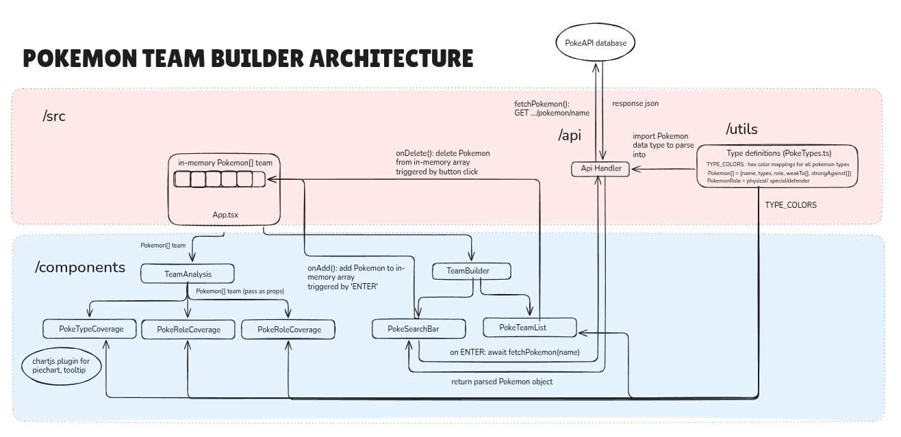

# Pokemon Team Builder

This simple web app helps you seamlessly add Pokemon to your team, view their performance at a glance and gives you actionable feedback on which pokemon types and roles can be added to improve your team

## Contents

1. [Overview](#overview)
   - [Features](#features)
   - [Architecture](#architecture)
2. [Setup Instructions](#getting-started)
3. [Testing Instructions](#testing)

## Overview

### Features

- **React**: Fast and flexible UI library for building user interfaces. (v. 19)
- **TypeScript**: Strongly typed JavaScript for better development experience. (v. 5)
- **Tailwind CSS**: Utility-first CSS framework for rapid UI development. (v. 4)
- **Vite**: Lightning-fast build tool for modern web projects. (v. 7)
- **ESLint**: Linting for maintaining code quality. (v. 9)
- **Prettier**: Code formatting for consistent style. (v. 3)
- **Husky**: Git hooks for enforcing pre-push checks. (v. 9)
- **pnpm**: Package manager for managing dependencies. (v. 10)

### Architecture



## Setup instructions

**NOTE**: The following setup instructions are taken from https://github.com/jhordyess/react-tailwind-ts-starter/blob/main/README.md, as this project was used as a template to work off. Further justifications are [below](#template-credits-and-tech-stack-justification)

### Prerequisites

1. Install [Node.js](https://nodejs.org/en/download) (LTS version recommended).
2. Install [pnpm](https://pnpm.io/installation) globally:

```sh
npm install -g pnpm@latest-10
```

### Setup project for development

1. Clone the repository:

```sh
git clone
```

2. Navigate to the project folder:

```sh
cd Pokemon-Team-Builder
```

3. Install dependencies:

```sh
pnpm i
```

4. Start the development server:

```sh
pnpm dev
```

5. Open your browser and visit [http://localhost:5173](http://localhost:5173) to see your project.

### Commands

#### Start the development server

```sh
pnpm dev
```

#### Build the project for production

```sh
pnpm build
```

#### Preview the project before production

```sh
pnpm start
```

#### Run TypeScript checks

```sh
pnpm ts-check
```

#### Lint the code

```sh
pnpm lint
```

#### Validate the project (lint + TypeScript checks)

```sh
pnpm validate
```

#### Format the code

```sh
pnpm format
```

---

## Testing

## Design decisions + data assumptions

### Template credits and tech stack justification

This project has used https://github.com/jhordyess/react-tailwind-ts-starter.git as a starter, as it contained all the desirable technologies rationalised below, with relevance to the project.

#### Technologies

- **React** : Uses Virtual DOM to allow fast updates of relevant statistics when new `Pokemon` are fetched and added to team. No full-page re-rendering is required, improving performance
- **TypeScript**: Provides static typing, allowing us to define a structured `Pokemon` type with required properties and enforces type safety of fetched data.
- **TailwindCSS**: Enables rapid UI development without writing a lot of custom CSS
- **Vite**: Lightning-fast build tool (improves general responsivity)
- **ESLint**: Linting tool used to maintain code quality
- **Prettier**: Automatically formats code to maintain consistent style, allowing consistent readability across multiple modules like frontend components and API handler
- **Husky**: Ensures linting and formatting checks pass before code is pushed, maintaining higher code quality and safeguarding against broken code being commited
- **pnpm**: Efficient package manager to install and manage dependencies

#### Plugins

- **chartj.s** : Provides a clean, responsive pie chart utility ideal for type coverage data presentation, as chart is pleasantly animated and as more data points are added

### Design decisions
