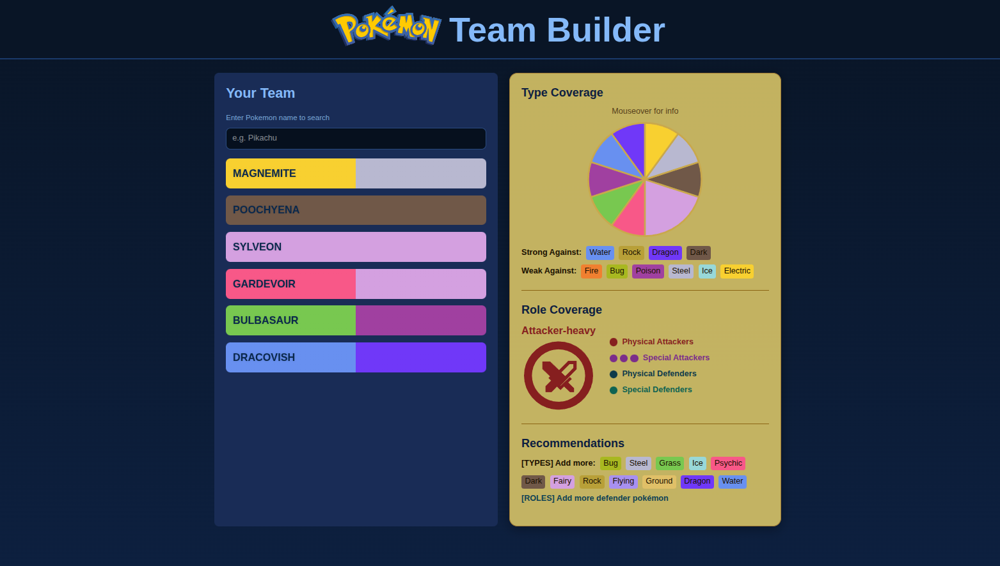
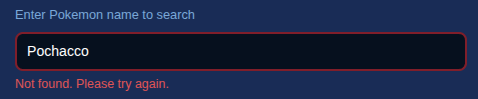
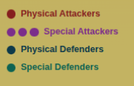

# Pokemon Team Builder

This [simple web app](https://pokemonteambuildertool.vercel.app/) helps you seamlessly add Pokemon to your team, view their performance at a glance and gives you actionable feedback on which pokemon types and roles can be added to improve your team

[](https://pokemonteambuildertool.vercel.app/)
## Contents

1. [Overview](#overview)
    * [Features](#features)
    * [Architecture](#architecture)
2. [Setup Instructions](#getting-started)
3. [Design decisions + data assumptions](#design-decisions--data-assumptions)
    * [Credits + Tech stack justifications](#template-credits-and-tech-stack-justification)
    * [Design decisions](#design-decisions)
    * [Data assumptions](#data-assumptions)

## Overview

### Features

- **Find your Pokemon**: 
  - Search and enter the name of any ***existing*** Pokemon to add it to your team (stored as a [`Pokemon`](#pokemon-data-type) data type in [`PokemonTeam`](#pokemonteam-type) object in-memory)
  - Error message is displayed if the Pokemon is not found/cannot connect to API server.
  
  

- **Build your team**
  - View the type of each Pokemon with its corresponding color

    *e.g. Pikachu is an electric-type (yellow) pokemon*

  

  *e.g. Charizard is a  dual-type fire (orange) and flying (light purple) pokemon*

  

  - Delete a Pokemon from your team by hovering over its card and clicking the `X` that appears at the right/ simply clicking the card
- **Analyse your team**
Team analytics are shown in the right-hand-side yellow section in real-time as you add and delete Pokemon. These are calculated in the `team_hander` module upon every Pokemon add to your `PokemonTeam`.

    - **Type Coverage**
        - **Type distribution**: Hover over the pie chart sections to see how many Pokemon you have of that corresponding type
        - **Strengths/Weaknesses**: Displays the types which Pokemon in your team are strong against and weak towards, respectively
            - Calculated by aggregating all unique strengths and weaknesses of individual Pokémon (`Pokemon::strongAgainst`, `Pokemon::weakTo`) and storing in the team(`PokemonTeam::allStrongAgainst` and `PokemonTeam::allWeakAgainst`)
    - **Role Coverage**
        - **Majority role**
            - Your team may recieve either `Attacker-heavy`, `Defender-heavy` and `Balanced` qualifications for its role coverage (see [`PokeTeamMainRole`](#poketeammainrole-child-data-type-like-enum))
            
            - Calculated by comparing total numbers of attackers and defenders by summing counts of 
                - **attackers** ([`PokemonRole`](#pokemonrole-child-data-type-like-enum) of `special-attacker`, `attacker`) vs
                - **defenders** ([`PokemonRole`](#pokemonrole-child-data-type-like-enum) of `special-defender`, `defender`)
             
        - **Role counts**
            - Simple dot chart visual of raw counts of `attacker` and `special-attacker` role pokemon, as well as `defender` and `special-defender` role Pokemon in your team
                            

    - **Recommendations**
        - **Role recommendations**: Advice on what role of Pokemon to add 
            - *e.g. if team is **attacker-heavy**, it recommends adding more **defensive** pokemon*
            - *e.g. if a team is **balanced**, it will state so*
        - **Type recommendations**: Advice on what types of Pokemon to add
            - Recommended by iterating through the types your team is weakest against (`PokemonTeam::allWeakAgainst`) and fetching the types which are strong against those.


#### What this app does
Provides a simple **team-level** overview of strengths and weaknesses, focusing on balancing out your team against different Pokemon types.

#### What this app does not do
* Visualise attack power (CP)
* Visualise stamina (HP)

### Architecture


## Setup instructions
**NOTE**: The following setup instructions are taken from https://github.com/jhordyess/react-tailwind-ts-starter/blob/main/README.md, as this project was used as a template to work off. Further justifications are [below](#template-credits-and-tech-stack-justification)
### Prerequisites

1. Install [Node.js](https://nodejs.org/en/download) (LTS version recommended).
2. Install [pnpm](https://pnpm.io/installation) globally:

```sh
npm install -g pnpm@latest-10
```

### Setup project for development

1. Clone the repository:

```sh
git clone 
```

2. Navigate to the project folder:

```sh
cd Pokemon-Team-Builder
```

3. Install dependencies:

```sh
pnpm i
```

4. Start the development server:

```sh
pnpm dev
```

5. Open your browser and visit [http://localhost:5173](http://localhost:5173) to see your project.


### Commands

#### Start the development server

```sh
pnpm dev
```

#### Build the project for production

```sh
pnpm build
```

#### Preview the project before production

```sh
pnpm start
```

#### Run TypeScript checks

```sh
pnpm ts-check
```

#### Lint the code

```sh
pnpm lint
```

#### Validate the project (lint + TypeScript checks)

```sh
pnpm validate
```

#### Format the code

```sh
pnpm format
```
---

## Design decisions + data assumptions


### Template credits and tech stack justification

This project has used https://github.com/jhordyess/react-tailwind-ts-starter.git as a starter, as it contained all the desirable technologies rationalised below, with relevance to the project.

#### Technologies

- **React** : Uses Virtual DOM to allow fast updates of relevant statistics when new `Pokemon` are fetched and added to team. No full-page re-rendering is required, improving performance
- **TypeScript**: Provides static typing, allowing us to define a structured `Pokemon` type with required properties and enforces type safety of fetched data.
- **TailwindCSS**: Enables rapid UI development without writing a lot of custom CSS
- **Vite**: Lightning-fast build tool (improves general responsivity)
- **ESLint**: Linting tool used to maintain code quality
- **Prettier**: Automatically formats code to maintain consistent style, allowing consistent readability across multiple modules like frontend components and API handler
- **Husky**: Ensures linting and formatting checks pass before code is pushed, maintaining higher code quality and safeguarding against broken code being commited
- **pnpm**: Efficient package manager to install and manage dependencies

#### Plugins
- **chartj.s** : Provides a clean, responsive pie chart utility ideal for type coverage data presentation, as chart is pleasantly animated and as more data points are added

### Design decisions

#### Data types
Using TypeScript, we are able to create data types to help parse the API resources fetched into usable data we can display.
#### Pokemon data type
**Parsed from**
`[PokemonAPI URL]/pokemon/{name}`
`[PokemonAPI URL]/type/{type_name}`

**Fields**
`name` : direct from name field of API response
`types` : parsed names accessed directly from types fields in API response
`role` : assigned based on strongest stat out of the [4 options](#pokemonrole-child-data-type-like-enum)
`weakTo` : iterating through `types`, fetch each type resource and access `damage_relations.double_damage_from` (Pokemon gets most damage from these)
`strongAgainst` : iterating through `types`, fetch each type resource and access `damage_relations.double_damage_to` (Pokemon delivers most damage to these)

```
type Pokemon = {
  name: string
  types: string[]
  role: PokemonRole
  weakTo: string[]
  strongAgainst: string[]
}
```
#### PokemonRole (child data type, like enum)
```
type PokemonRole = 'attacker' | 'defender' | 'special-attacker' | 'special-defender'
```
#### PokemonTeam type
* Info fields are aggregated from all `Pokemon` objects in its `pokemonList`
  *  **Roles** are simply counted (each pokemon has a unique role)
  *  **Types** are accumulated in a **set** to prevent overlap (each pokemon may have multiple types, we want general coverage)
* Overlapping types in `allWeakAgainst` and `allStrongAgainst` are resolved by removing them from both lists (team can equally counter and be threatened by them).
* `recommendAddType` is resolved by fetching strongest pokemon that counter team's `allWeakAgainst`
```
type PokemonTeam = {
  pokemonList: Pokemon[]
  length: number
  totalAttackers: number
  totalDefenders: number
  totalPhysicalAttackers: number
  totalSpecialAttackers: number
  totalPhysicalDefenders: number
  totalSpecialDefenders: number
  allTeamTypes: string[]
  allWeakAgainst: string[]
  allStrongAgainst: string[]
  teamMainRole: PokeTeamMainRole
  recommendAddType: string[]
  recommendAddRole: PokeTeamMainRole
}
```
#### PokeTeamMainRole (child data type, like enum)
Whichever role has highest count in each team/ `Balanced` if equal
```
type PokeTeamMainRole = 'Attacker' | 'Defender' | 'Balanced'
```
### Data assumptions
1. All Pokemon names are valid strings matching those in the PokeAPI
2. Each Pokemon has no more than 2 types (factually true)
3. Each Pokémon has exactly one role: 'attacker', 'defender', 'special-attacker', 'special-defender'. Role is determined based on base stats (highest among Attack, Defense, Special Attack, Special Defense).
4. Each Pokemon Type has `damage_relations.double_damage_to` and `damage_relations.double_damage_from` fields

**If any of these assumptions are not met and empty data field is parsed, corresponding fields will be remain as the initialised values [0 or empty string depending on the type (`number`/ `string`)] , ensuring data safety.**
